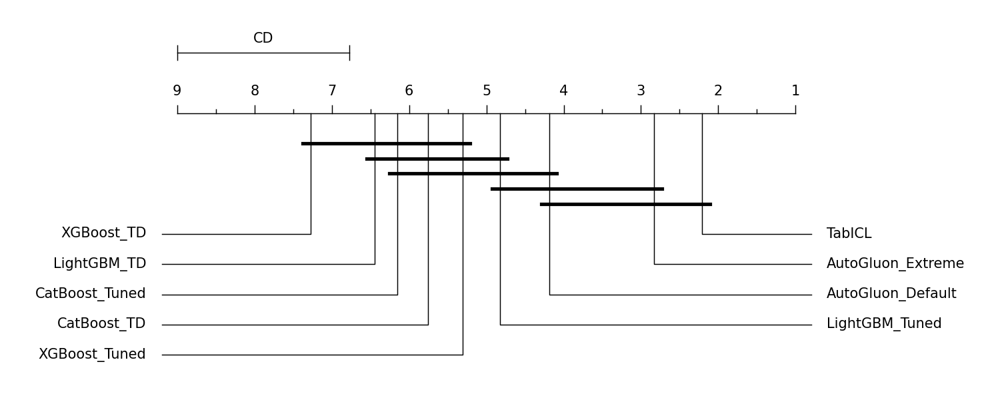
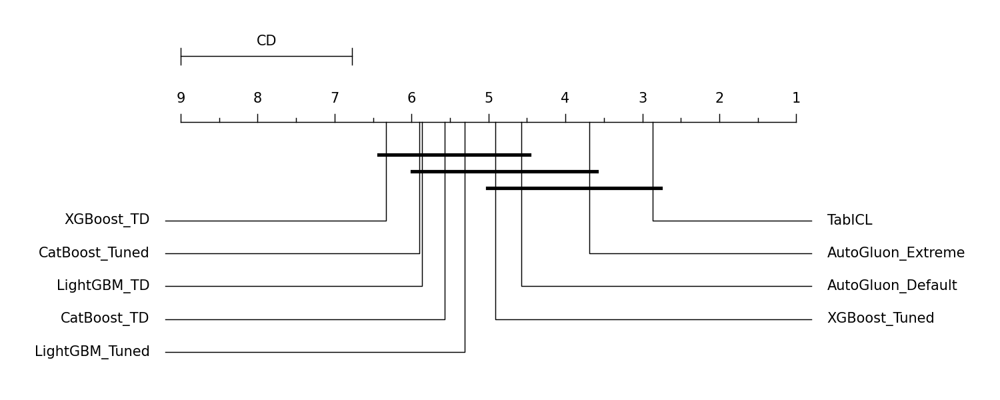
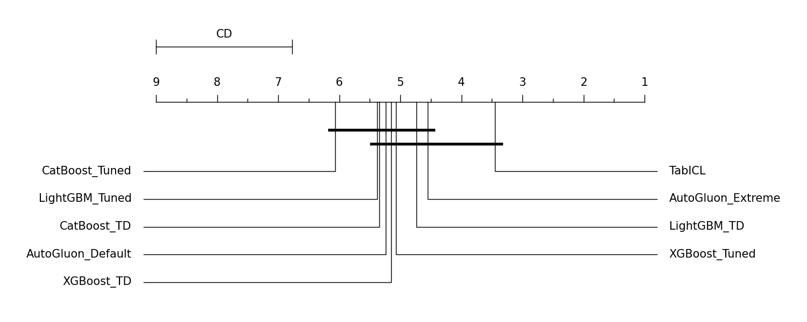
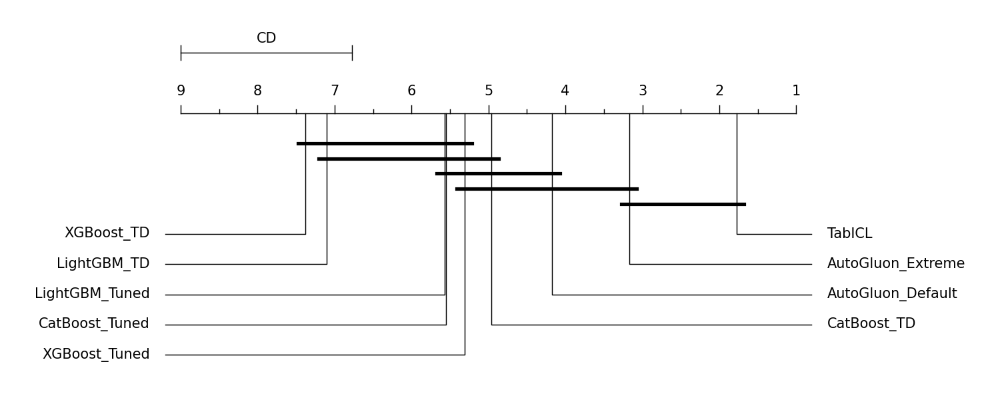
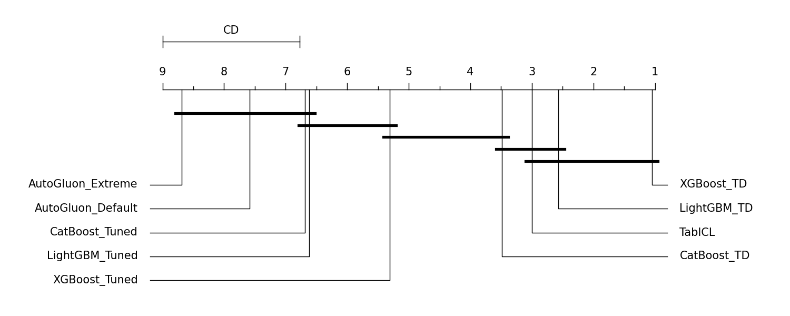

# Prévia Consolidada dos Resultados

Este documento compila as tabelas de desempenho global, as estratificações cruzadas (regime, missings e tipo), os gráficos de diferença crítica (Friedman + Nemenyi) e as análises Bayesianas.

## 1. Tabelas de Desempenho e Estratificação

### 01 Desempenho Medio Global

> **Como interpretar:** Esta tabela mostra a média absoluta de cada modelo em todas as métricas nos 30 datasets. Use-a para ver quem teve a melhor performance geral. Lembre-se: para CE (Cross-Entropy) e Tempo, valores MENORES são melhores.

| model             |   AUC_OVO |    ACC |   G_Mean |     CE | Total_Time (HH:MM:SS)   |
|:------------------|----------:|-------:|---------:|-------:|:------------------------|
| AutoGluon_Default |    0.9094 | 0.9102 |   0.6577 | 0.232  | 00:26:36                |
| AutoGluon_Extreme |    0.9108 | 0.9128 |   0.641  | 0.2198 | 01:00:58                |
| CatBoost_TD       |    0.8989 | 0.9078 |   0.6796 | 0.2396 | 00:00:23                |
| CatBoost_Tuned    |    0.9002 | 0.9096 |   0.6494 | 0.2449 | 00:13:02                |
| LightGBM_TD       |    0.8938 | 0.9063 |   0.6561 | 0.3237 | 00:00:32                |
| LightGBM_Tuned    |    0.8977 | 0.9095 |   0.6801 | 0.2562 | 00:48:19                |
| TabICL            |    0.909  | 0.9165 |   0.6889 | 0.2025 | 00:00:54                |
| XGBoost_TD        |    0.8897 | 0.9064 |   0.6587 | 0.2688 | 00:00:01                |
| XGBoost_Tuned     |    0.8982 | 0.9102 |   0.6553 | 0.2331 | 00:05:59                |

---

### 02 Lista 30 Datasets

> **Como interpretar:** Apresenta as propriedades brutas dos datasets (tamanho, features, missings). Ideal para o anexo do TCC para provar a diversidade da base.

| dataset                |    tid | regime   |   n_samples |   n_features |   n_classes | has_missing   | type       |
|:-----------------------|-------:|:---------|------------:|-------------:|------------:|:--------------|:-----------|
| diabetes               |     37 | small    |         768 |            9 |           2 | No            | Binary     |
| anneal                 |      2 | small    |         898 |           39 |           5 | Yes           | Multiclass |
| credit-g               | 168757 | medium   |        1000 |           21 |           2 | No            | Binary     |
| qsar-biodeg            | 359956 | medium   |        1055 |           42 |           2 | No            | Binary     |
| baseball               |   2077 | medium   |        1340 |           17 |           3 | Yes           | Multiclass |
| yeast                  |   2073 | medium   |        1484 |            9 |          10 | No            | Multiclass |
| splice                 |     45 | medium   |        3190 |           61 |           3 | No            | Multiclass |
| Bioresponse            | 359967 | medium   |        3751 |         1777 |           2 | No            | Binary     |
| hypothyroid            |   3011 | medium   |        3772 |           30 |           4 | Yes           | Multiclass |
| hiva_agnostic          |   3892 | medium   |        4229 |         1618 |           2 | No            | Binary     |
| spambase               |     43 | medium   |        4601 |           58 |           2 | No            | Binary     |
| waveform-5000          |     58 | medium   |        5000 |           41 |           3 | No            | Multiclass |
| churn                  | 359968 | medium   |        5000 |           21 |           2 | No            | Binary     |
| page-blocks            |     30 | medium   |        5473 |           11 |           5 | No            | Multiclass |
| optdigits              |     28 | medium   |        5620 |           65 |          10 | No            | Multiclass |
| satimage               |   2074 | medium   |        6430 |           37 |           6 | No            | Multiclass |
| isolet                 |   3481 | medium   |        7797 |          618 |          26 | No            | Multiclass |
| mushroom               |     24 | medium   |        8124 |           23 |           2 | Yes           | Binary     |
| JapaneseVowels         |   3510 | medium   |        9961 |           15 |           9 | No            | Multiclass |
| pendigits              |     32 | large    |       10992 |           17 |          10 | No            | Multiclass |
| nursery                |     26 | large    |       12960 |            9 |           5 | No            | Multiclass |
| letter                 |      6 | large    |       20000 |           17 |          26 | No            | Multiclass |
| houses                 |   3688 | large    |       20640 |            9 |           2 | No            | Binary     |
| Amazon_employee_access | 359979 | large    |       32769 |           10 |           2 | No            | Binary     |
| KDDCup09_appetency     |   3945 | large    |       50000 |          231 |           2 | Yes           | Binary     |
| APSFailure             | 168868 | large    |       76000 |          171 |           2 | Yes           | Binary     |
| KDD98                  | 361329 | large    |       82318 |          478 |           2 | Yes           | Binary     |
| Diabetes130US          | 211986 | large    |      101766 |           50 |           3 | No            | Multiclass |
| porto-seguro           | 360113 | large    |      595212 |           58 |           2 | Yes           | Binary     |

---

### 03 Estratificacao has missing

> **Como interpretar:** Mostra a média de AUC_OVO segmentada entre datasets completos (No) e datasets com dados faltantes (Yes). Avalia a robustez do modelo à sujeira.

| has_missing   |   AutoGluon_Default |   AutoGluon_Extreme |   CatBoost_TD |   CatBoost_Tuned |   LightGBM_TD |   LightGBM_Tuned |   TabICL |   XGBoost_TD |   XGBoost_Tuned |
|:--------------|--------------------:|--------------------:|--------------:|-----------------:|--------------:|-----------------:|---------:|-------------:|----------------:|
| No            |              0.9267 |              0.9313 |        0.9185 |           0.9219 |        0.911  |           0.9244 |   0.9291 |       0.9178 |          0.9225 |
| Yes           |              0.8829 |              0.8769 |        0.8736 |           0.862  |        0.8697 |           0.8478 |   0.873  |       0.8391 |          0.8543 |

---

### 03 Estratificacao regime

> **Como interpretar:** Quebra o desempenho de AUC_OVO pelo tamanho do dataset (Small, Medium, Large). Crucial para demonstrar se o TabICL perde força em datasets gigantes.

| regime   |   AutoGluon_Default |   AutoGluon_Extreme |   CatBoost_TD |   CatBoost_Tuned |   LightGBM_TD |   LightGBM_Tuned |   TabICL |   XGBoost_TD |   XGBoost_Tuned |
|:---------|--------------------:|--------------------:|--------------:|-----------------:|--------------:|-----------------:|---------:|-------------:|----------------:|
| large    |              0.8879 |              0.8674 |        0.8589 |           0.8532 |        0.8422 |           0.8628 |   0.8632 |       0.8497 |          0.859  |
| medium   |              0.9325 |              0.945  |        0.9345 |           0.9354 |        0.9332 |           0.9245 |   0.9427 |       0.9231 |          0.9283 |
| small    |              0.8436 |              0.862  |        0.8309 |           0.8579 |        0.842  |           0.8623 |   0.8702 |       0.8339 |          0.8581 |

---

### 03 Estratificacao type

> **Como interpretar:** Separa os resultados entre classificação Binária e Multiclasse, mostrando a estabilidade do modelo em diferentes tarefas.

| type       |   AutoGluon_Default |   AutoGluon_Extreme |   CatBoost_TD |   CatBoost_Tuned |   LightGBM_TD |   LightGBM_Tuned |   TabICL |   XGBoost_TD |   XGBoost_Tuned |
|:-----------|--------------------:|--------------------:|--------------:|-----------------:|--------------:|-----------------:|---------:|-------------:|----------------:|
| Binary     |              0.8797 |              0.8695 |        0.8536 |           0.8563 |        0.8529 |           0.8599 |   0.8621 |       0.8446 |          0.8592 |
| Multiclass |              0.947  |              0.96   |        0.9551 |           0.9511 |        0.9431 |           0.9437 |   0.9618 |       0.9441 |          0.9452 |

---

## 2. Gráficos de Diferença Crítica (CD Diagrams)
> **Como interpretar:** O teste de Friedman avalia a significância global. Se houver diferença, o post-hoc de Nemenyi calcula a Distância Crítica (CD). Modelos conectados por uma barra vermelha espessa **NÃO** possuem diferença estatisticamente significante entre si. Modelos isolados à direita (ou à esquerda, dependendo da métrica) são os vencedores matemáticos isolados.

### CD Diagram: AUC_OVO

### CD Diagram: ACC

### CD Diagram: G_Mean

### CD Diagram: CE

### CD Diagram: total_time_s

---

## 3. Análise Bayesiana Par a Par (ROPE)
> **Como interpretar:** As tabelas abaixo mostram a probabilidade Bayesiana.  é a chance de o Modelo A ser pior que o B.  é a chance de serem estatisticamente idênticos (dentro da margem de empate ROPE). E  é a chance de o Modelo A ser superior. Valores de  acima de 0.95 (95%) indicam superioridade probabilística quase certa.

### Bayesiana: AUC_OVO

| model_a           | model_b           |   p_a_worse |   p_equivalent |   p_a_better |
|:------------------|:------------------|------------:|---------------:|-------------:|
| AutoGluon_Default | AutoGluon_Extreme |     0       |        0.98068 |      0.01932 |
| AutoGluon_Default | CatBoost_TD       |     0.04216 |        0.95504 |      0.0028  |
| AutoGluon_Default | CatBoost_Tuned    |     0.02936 |        0.96508 |      0.00556 |
| AutoGluon_Default | LightGBM_TD       |     0.05174 |        0.94508 |      0.00318 |
| AutoGluon_Default | LightGBM_Tuned    |     0.0008  |        0.99908 |      0.00012 |
| AutoGluon_Default | TabICL            |     0       |        0.98782 |      0.01218 |
| AutoGluon_Default | XGBoost_TD        |     0.35816 |        0.64178 |      6e-05   |
| AutoGluon_Default | XGBoost_Tuned     |     0.00086 |        0.99906 |      8e-05   |
| AutoGluon_Extreme | CatBoost_TD       |     0.15718 |        0.84282 |      0       |
| AutoGluon_Extreme | CatBoost_Tuned    |     0.43034 |        0.56966 |      0       |
| AutoGluon_Extreme | LightGBM_TD       |     0.43256 |        0.56744 |      0       |
| AutoGluon_Extreme | LightGBM_Tuned    |     0.0728  |        0.9272  |      0       |
| AutoGluon_Extreme | TabICL            |     0.0008  |        0.99918 |      2e-05   |
| AutoGluon_Extreme | XGBoost_TD        |     0.66972 |        0.33028 |      0       |
| AutoGluon_Extreme | XGBoost_Tuned     |     0.09272 |        0.90728 |      0       |
| CatBoost_TD       | CatBoost_Tuned    |     0.01222 |        0.9767  |      0.01108 |
| CatBoost_TD       | LightGBM_TD       |     0.00014 |        0.9994  |      0.00046 |
| CatBoost_TD       | LightGBM_Tuned    |     0.00048 |        0.99322 |      0.0063  |
| CatBoost_TD       | TabICL            |     4e-05   |        0.8646  |      0.13536 |
| CatBoost_TD       | XGBoost_TD        |     0.01586 |        0.984   |      0.00014 |
| CatBoost_TD       | XGBoost_Tuned     |     0.00156 |        0.99136 |      0.00708 |
| CatBoost_Tuned    | LightGBM_TD       |     0.03512 |        0.96464 |      0.00024 |
| CatBoost_Tuned    | LightGBM_Tuned    |     0.00112 |        0.99426 |      0.00462 |
| CatBoost_Tuned    | TabICL            |     0       |        0.76318 |      0.23682 |
| CatBoost_Tuned    | XGBoost_TD        |     0.07496 |        0.92424 |      0.0008  |
| CatBoost_Tuned    | XGBoost_Tuned     |     0.00066 |        0.99918 |      0.00016 |
| LightGBM_TD       | LightGBM_Tuned    |     0.0005  |        0.99094 |      0.00856 |
| LightGBM_TD       | TabICL            |     0       |        0.69232 |      0.30768 |
| LightGBM_TD       | XGBoost_TD        |     0.01646 |        0.9819  |      0.00164 |
| LightGBM_TD       | XGBoost_Tuned     |     0.00026 |        0.9926  |      0.00714 |
| LightGBM_Tuned    | TabICL            |     0       |        0.97266 |      0.02734 |
| LightGBM_Tuned    | XGBoost_TD        |     0.05266 |        0.94734 |      0       |
| LightGBM_Tuned    | XGBoost_Tuned     |     0.0001  |        0.99978 |      0.00012 |
| TabICL            | XGBoost_TD        |     0.42762 |        0.57238 |      0       |
| TabICL            | XGBoost_Tuned     |     0.1018  |        0.8982  |      0       |
| XGBoost_TD        | XGBoost_Tuned     |     0       |        0.94122 |      0.05878 |

### Bayesiana: ACC

| model_a           | model_b           |   p_a_worse |   p_equivalent |   p_a_better |
|:------------------|:------------------|------------:|---------------:|-------------:|
| AutoGluon_Default | AutoGluon_Extreme |     4e-05   |        0.99984 |      0.00012 |
| AutoGluon_Default | CatBoost_TD       |     0.0025  |        0.9971  |      0.0004  |
| AutoGluon_Default | CatBoost_Tuned    |     0.00016 |        0.9997  |      0.00014 |
| AutoGluon_Default | LightGBM_TD       |     0.01652 |        0.98296 |      0.00052 |
| AutoGluon_Default | LightGBM_Tuned    |     0       |        1       |      0       |
| AutoGluon_Default | TabICL            |     0       |        0.98888 |      0.01112 |
| AutoGluon_Default | XGBoost_TD        |     0.00666 |        0.9929  |      0.00044 |
| AutoGluon_Default | XGBoost_Tuned     |     0       |        0.9999  |      0.0001  |
| AutoGluon_Extreme | CatBoost_TD       |     0.00726 |        0.99274 |      0       |
| AutoGluon_Extreme | CatBoost_Tuned    |     0.00012 |        0.99988 |      0       |
| AutoGluon_Extreme | LightGBM_TD       |     0.012   |        0.988   |      0       |
| AutoGluon_Extreme | LightGBM_Tuned    |     0.00114 |        0.99886 |      0       |
| AutoGluon_Extreme | TabICL            |     0       |        0.99984 |      0.00016 |
| AutoGluon_Extreme | XGBoost_TD        |     0.01714 |        0.98286 |      0       |
| AutoGluon_Extreme | XGBoost_Tuned     |     0.00018 |        0.99982 |      0       |
| CatBoost_TD       | CatBoost_Tuned    |     0       |        0.99914 |      0.00086 |
| CatBoost_TD       | LightGBM_TD       |     4e-05   |        0.99996 |      0       |
| CatBoost_TD       | LightGBM_Tuned    |     0       |        0.99988 |      0.00012 |
| CatBoost_TD       | TabICL            |     0       |        0.83044 |      0.16956 |
| CatBoost_TD       | XGBoost_TD        |     0.0005  |        0.9995  |      0       |
| CatBoost_TD       | XGBoost_Tuned     |     0       |        0.99978 |      0.00022 |
| CatBoost_Tuned    | LightGBM_TD       |     0.00076 |        0.99924 |      0       |
| CatBoost_Tuned    | LightGBM_Tuned    |     0       |        1       |      0       |
| CatBoost_Tuned    | TabICL            |     0       |        0.93032 |      0.06968 |
| CatBoost_Tuned    | XGBoost_TD        |     0.0013  |        0.99868 |      2e-05   |
| CatBoost_Tuned    | XGBoost_Tuned     |     0       |        1       |      0       |
| LightGBM_TD       | LightGBM_Tuned    |     0       |        0.99606 |      0.00394 |
| LightGBM_TD       | TabICL            |     0       |        0.89122 |      0.10878 |
| LightGBM_TD       | XGBoost_TD        |     0.0001  |        0.99914 |      0.00076 |
| LightGBM_TD       | XGBoost_Tuned     |     6e-05   |        0.99624 |      0.0037  |
| LightGBM_Tuned    | TabICL            |     0       |        0.9425  |      0.0575  |
| LightGBM_Tuned    | XGBoost_TD        |     0.0008  |        0.9991  |      0.0001  |
| LightGBM_Tuned    | XGBoost_Tuned     |     0       |        1       |      0       |
| TabICL            | XGBoost_TD        |     0.14306 |        0.85694 |      0       |
| TabICL            | XGBoost_Tuned     |     0.02742 |        0.97258 |      0       |
| XGBoost_TD        | XGBoost_Tuned     |     0       |        0.99964 |      0.00036 |

### Bayesiana: G_Mean

| model_a           | model_b           |   p_a_worse |   p_equivalent |   p_a_better |
|:------------------|:------------------|------------:|---------------:|-------------:|
| AutoGluon_Default | AutoGluon_Extreme |     0.0081  |        0.90446 |      0.08744 |
| AutoGluon_Default | CatBoost_TD       |     0.06534 |        0.45528 |      0.47938 |
| AutoGluon_Default | CatBoost_Tuned    |     0.00894 |        0.96748 |      0.02358 |
| AutoGluon_Default | LightGBM_TD       |     0.01132 |        0.76702 |      0.22166 |
| AutoGluon_Default | LightGBM_Tuned    |     0.01714 |        0.89634 |      0.08652 |
| AutoGluon_Default | TabICL            |     0.00054 |        0.42878 |      0.57068 |
| AutoGluon_Default | XGBoost_TD        |     0.00614 |        0.75246 |      0.2414  |
| AutoGluon_Default | XGBoost_Tuned     |     0.00914 |        0.7546  |      0.23626 |
| AutoGluon_Extreme | CatBoost_TD       |     0.02    |        0.91876 |      0.06124 |
| AutoGluon_Extreme | CatBoost_Tuned    |     0.0307  |        0.96318 |      0.00612 |
| AutoGluon_Extreme | LightGBM_TD       |     0.00754 |        0.85766 |      0.1348  |
| AutoGluon_Extreme | LightGBM_Tuned    |     0.16514 |        0.79638 |      0.03848 |
| AutoGluon_Extreme | TabICL            |     0.00066 |        0.9507  |      0.04864 |
| AutoGluon_Extreme | XGBoost_TD        |     0.0845  |        0.66702 |      0.24848 |
| AutoGluon_Extreme | XGBoost_Tuned     |     0.02854 |        0.9269  |      0.04456 |
| CatBoost_TD       | CatBoost_Tuned    |     0.18874 |        0.79806 |      0.0132  |
| CatBoost_TD       | LightGBM_TD       |     0.01536 |        0.89644 |      0.0882  |
| CatBoost_TD       | LightGBM_Tuned    |     0.20918 |        0.78286 |      0.00796 |
| CatBoost_TD       | TabICL            |     0.01908 |        0.52644 |      0.45448 |
| CatBoost_TD       | XGBoost_TD        |     0.00886 |        0.87466 |      0.11648 |
| CatBoost_TD       | XGBoost_Tuned     |     0.01812 |        0.94494 |      0.03694 |
| CatBoost_Tuned    | LightGBM_TD       |     0.0142  |        0.80632 |      0.17948 |
| CatBoost_Tuned    | LightGBM_Tuned    |     0.00462 |        0.99384 |      0.00154 |
| CatBoost_Tuned    | TabICL            |     0.00128 |        0.1419  |      0.85682 |
| CatBoost_Tuned    | XGBoost_TD        |     0.00038 |        0.82102 |      0.1786  |
| CatBoost_Tuned    | XGBoost_Tuned     |     0.00016 |        0.99094 |      0.0089  |
| LightGBM_TD       | LightGBM_Tuned    |     0.1217  |        0.8677  |      0.0106  |
| LightGBM_TD       | TabICL            |     0.10964 |        0.33584 |      0.55452 |
| LightGBM_TD       | XGBoost_TD        |     0.02848 |        0.94988 |      0.02164 |
| LightGBM_TD       | XGBoost_Tuned     |     0.03926 |        0.9449  |      0.01584 |
| LightGBM_Tuned    | TabICL            |     0.00154 |        0.2633  |      0.73516 |
| LightGBM_Tuned    | XGBoost_TD        |     0.01608 |        0.70172 |      0.2822  |
| LightGBM_Tuned    | XGBoost_Tuned     |     0.00122 |        0.96796 |      0.03082 |
| TabICL            | XGBoost_TD        |     0.77938 |        0.15582 |      0.0648  |
| TabICL            | XGBoost_Tuned     |     0.51972 |        0.46656 |      0.01372 |
| XGBoost_TD        | XGBoost_Tuned     |     0.00332 |        0.99542 |      0.00126 |

### Bayesiana: CE

| model_a           | model_b           |   p_a_worse |   p_equivalent |   p_a_better |
|:------------------|:------------------|------------:|---------------:|-------------:|
| AutoGluon_Default | AutoGluon_Extreme |     0       |        0.9994  |      0.0006  |
| AutoGluon_Default | CatBoost_TD       |     0.0002  |        0.999   |      0.0008  |
| AutoGluon_Default | CatBoost_Tuned    |     0.00102 |        0.998   |      0.00098 |
| AutoGluon_Default | LightGBM_TD       |     0.27012 |        0.7283  |      0.00158 |
| AutoGluon_Default | LightGBM_Tuned    |     0.00228 |        0.99736 |      0.00036 |
| AutoGluon_Default | TabICL            |     0       |        0.99632 |      0.00368 |
| AutoGluon_Default | XGBoost_TD        |     0.09836 |        0.89958 |      0.00206 |
| AutoGluon_Default | XGBoost_Tuned     |     0       |        0.9992  |      0.0008  |
| AutoGluon_Extreme | CatBoost_TD       |     0.00282 |        0.99718 |      0       |
| AutoGluon_Extreme | CatBoost_Tuned    |     0.00104 |        0.99896 |      0       |
| AutoGluon_Extreme | LightGBM_TD       |     0.2238  |        0.7762  |      0       |
| AutoGluon_Extreme | LightGBM_Tuned    |     0.00534 |        0.99466 |      0       |
| AutoGluon_Extreme | TabICL            |     0       |        1       |      0       |
| AutoGluon_Extreme | XGBoost_TD        |     0.1491  |        0.8509  |      0       |
| AutoGluon_Extreme | XGBoost_Tuned     |     2e-05   |        0.99998 |      0       |
| CatBoost_TD       | CatBoost_Tuned    |     0.00158 |        0.99842 |      0       |
| CatBoost_TD       | LightGBM_TD       |     0.00778 |        0.99222 |      0       |
| CatBoost_TD       | LightGBM_Tuned    |     0.00162 |        0.99838 |      0       |
| CatBoost_TD       | TabICL            |     0       |        0.96316 |      0.03684 |
| CatBoost_TD       | XGBoost_TD        |     0.01566 |        0.98434 |      0       |
| CatBoost_TD       | XGBoost_Tuned     |     0       |        1       |      0       |
| CatBoost_Tuned    | LightGBM_TD       |     0.13906 |        0.85618 |      0.00476 |
| CatBoost_Tuned    | LightGBM_Tuned    |     0.0025  |        0.99586 |      0.00164 |
| CatBoost_Tuned    | TabICL            |     0       |        0.9838  |      0.0162  |
| CatBoost_Tuned    | XGBoost_TD        |     0.06228 |        0.9351  |      0.00262 |
| CatBoost_Tuned    | XGBoost_Tuned     |     6e-05   |        0.99892 |      0.00102 |
| LightGBM_TD       | LightGBM_Tuned    |     0.00126 |        0.97646 |      0.02228 |
| LightGBM_TD       | TabICL            |     0       |        0.25886 |      0.74114 |
| LightGBM_TD       | XGBoost_TD        |     0       |        0.99674 |      0.00326 |
| LightGBM_TD       | XGBoost_Tuned     |     0       |        0.96142 |      0.03858 |
| LightGBM_Tuned    | TabICL            |     0       |        0.84694 |      0.15306 |
| LightGBM_Tuned    | XGBoost_TD        |     0.0162  |        0.98266 |      0.00114 |
| LightGBM_Tuned    | XGBoost_Tuned     |     0       |        0.99904 |      0.00096 |
| TabICL            | XGBoost_TD        |     0.68642 |        0.31358 |      0       |
| TabICL            | XGBoost_Tuned     |     0.00298 |        0.99702 |      0       |
| XGBoost_TD        | XGBoost_Tuned     |     0       |        0.95168 |      0.04832 |

### Bayesiana: total_time_s

| model_a           | model_b           |   p_a_worse |   p_equivalent |   p_a_better |
|:------------------|:------------------|------------:|---------------:|-------------:|
| AutoGluon_Default | AutoGluon_Extreme |     1       |         0      |      0       |
| AutoGluon_Default | CatBoost_TD       |     0       |         0      |      1       |
| AutoGluon_Default | CatBoost_Tuned    |     0       |         0      |      1       |
| AutoGluon_Default | LightGBM_TD       |     0       |         0      |      1       |
| AutoGluon_Default | LightGBM_Tuned    |     0.20956 |         0      |      0.79044 |
| AutoGluon_Default | TabICL            |     0       |         0      |      1       |
| AutoGluon_Default | XGBoost_TD        |     0       |         0      |      1       |
| AutoGluon_Default | XGBoost_Tuned     |     0       |         0      |      1       |
| AutoGluon_Extreme | CatBoost_TD       |     0       |         0      |      1       |
| AutoGluon_Extreme | CatBoost_Tuned    |     0       |         0      |      1       |
| AutoGluon_Extreme | LightGBM_TD       |     0       |         0      |      1       |
| AutoGluon_Extreme | LightGBM_Tuned    |     0.00728 |         0      |      0.99272 |
| AutoGluon_Extreme | TabICL            |     0       |         0      |      1       |
| AutoGluon_Extreme | XGBoost_TD        |     0       |         0      |      1       |
| AutoGluon_Extreme | XGBoost_Tuned     |     0       |         0      |      1       |
| CatBoost_TD       | CatBoost_Tuned    |     1       |         0      |      0       |
| CatBoost_TD       | LightGBM_TD       |     0.02398 |         0      |      0.97602 |
| CatBoost_TD       | LightGBM_Tuned    |     1       |         0      |      0       |
| CatBoost_TD       | TabICL            |     0.0886  |         0      |      0.9114  |
| CatBoost_TD       | XGBoost_TD        |     0       |         0      |      1       |
| CatBoost_TD       | XGBoost_Tuned     |     1       |         0      |      0       |
| CatBoost_Tuned    | LightGBM_TD       |     0       |         0      |      1       |
| CatBoost_Tuned    | LightGBM_Tuned    |     0.62774 |         0      |      0.37226 |
| CatBoost_Tuned    | TabICL            |     0       |         0      |      1       |
| CatBoost_Tuned    | XGBoost_TD        |     0       |         0      |      1       |
| CatBoost_Tuned    | XGBoost_Tuned     |     0       |         0      |      1       |
| LightGBM_TD       | LightGBM_Tuned    |     1       |         0      |      0       |
| LightGBM_TD       | TabICL            |     0.6803  |         2e-05  |      0.31968 |
| LightGBM_TD       | XGBoost_TD        |     0       |         0.0028 |      0.9972  |
| LightGBM_TD       | XGBoost_Tuned     |     1       |         0      |      0       |
| LightGBM_Tuned    | TabICL            |     0       |         0      |      1       |
| LightGBM_Tuned    | XGBoost_TD        |     0       |         0      |      1       |
| LightGBM_Tuned    | XGBoost_Tuned     |     6e-05   |         0      |      0.99994 |
| TabICL            | XGBoost_TD        |     0       |         0      |      1       |
| TabICL            | XGBoost_Tuned     |     1       |         0      |      0       |
| XGBoost_TD        | XGBoost_Tuned     |     1       |         0      |      0       |

